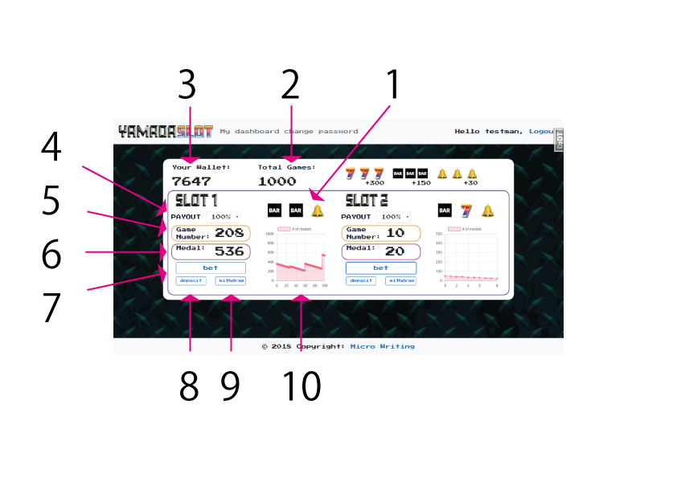
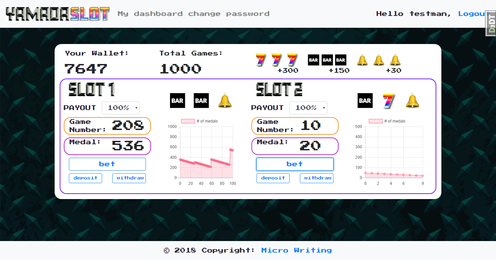
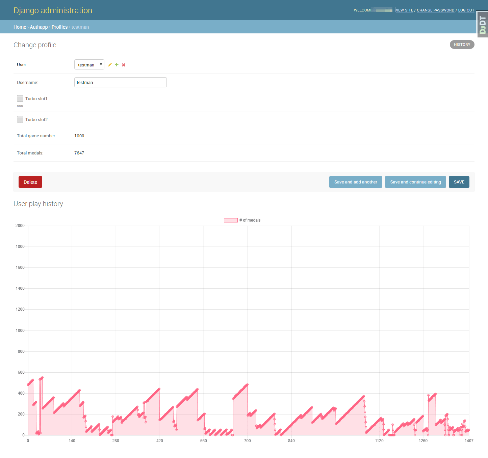

# pro43_game5
Modify YAMADA SLOT (Supports mysql) 

Online Slot Game Simulator Version 2
====

This work is under development.

#Overview

This is an online slot game platform made by django-framework.
It is made for studying personal and is currently under development.

## Description

This is an online slot simulator which can see increase and decrease of medals by graph.
On the game screen you can check the history of 100 games, and you can check the history of 2,000 games of each user on the admin screen.

1.Game window

You can check the actual game picture.

2.Total Games

After creating the account of user, count all the total games so far.

3.Your Wallet

Display getting number of total medals after creating the account of the user.

4.Payout

Since this is simulator, the user can choose three types of payout rates(95%, 100%, 105%)

5.Game Number

Display a game counts after depositing into slot game.

6.Medal

Display number of medals after depositing into slot game.

7.bet

This button may be called "SPIN". Clicking on this button, three subtracted from the medal, and the game do one time.

8.deposit

It is subtracted 50 medals from "your wallet" and deposited on 50 medals to "medal".

9.Withdraw

It will return the medal to "your wallet".

10.Graph

Display the history of past 100 games by graph.

## Image

## Requirement

I used the following package to develop this work.

djangorestframework==3.8.2

django-bootstrap-form==3.4

and this application use bootstrap and chart.js.
It is necessary to paste bootstrap and chart.js CDN to template.

## Install

Since django's secret key is removed from this repository, I recomend to install only applications.
And also, this application is under development, so I will not be responsible for anything.
